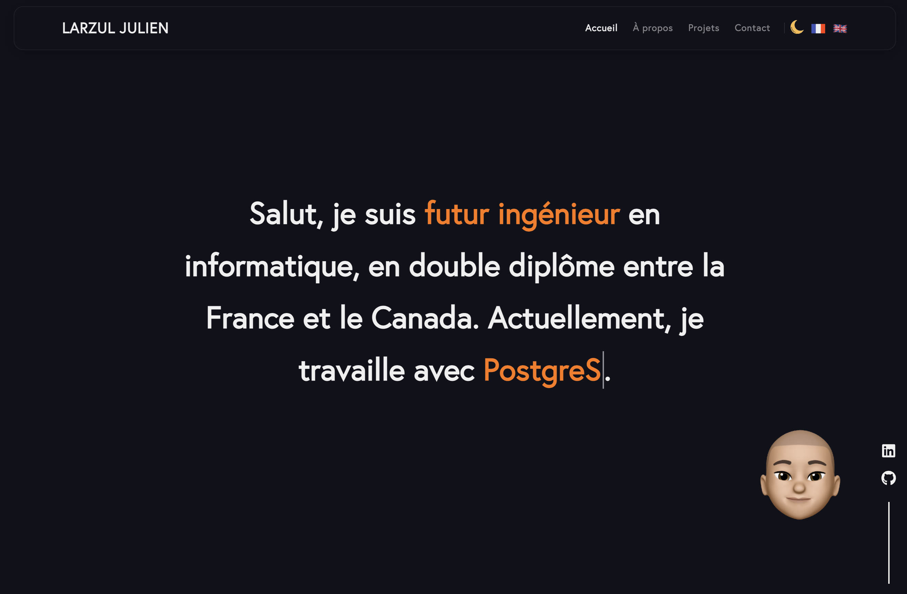

# Portfolio

Bienvenue sur mon portfolio personnel créé avec React.js. Ce projet est une vitrine de mes compétences en développement web et de mes projets réalisés.  
<<<<<<< HEAD
Accès à mon Portfolio 💿 : https://larzuljulien.com
=======
Accès au Portfolio 💿 : https://larzuljulien.com
>>>>>>> dbdc1df86b06baff2fdc87c6727221bae45d1a63





## Introduction

Ce portfolio est conçu pour mettre en avant mes projets, mes compétences et mon parcours en tant qu'étudiant ingénieur informatique. Il est développé avec React.js pour développer ma compréhension
de cette bibliothèque JavaScript populaire.

## Contributeurs

- Julien LARZUL

## Fonctionnalités

- **Navigation fluide :** Utilisation de React Router pour une expérience de navigation sans rechargement de page.
- **Design Responsive :** S'adapte à tous les types d'écrans pour une accessibilité maximale.
- **Portfolio Dynamique :** Projets affichés avec des animations et filtrables par catégories.
- **Formulaire de Contact :** Intégration d'un formulaire pour faciliter la prise de contact.

## Technologies Utilisées

- React.js
- HTML5
- CSS3
- JavaScript

## Installation et Lancement

Pour installer et lancer ce projet sur votre machine locale, suivez ces étapes :

```bash
   git clone https://github.com/julienlrzl/Portfolio.git
```

```bash
   npm install
```

```bash
   npm start
```

Le projet sera accessible à l'adresse http://localhost:3000.

## Contact

Pour toute question ou suggestion, n'hésitez pas à me contacter à julien.larzul@etu.univ-lyon1.fr.
